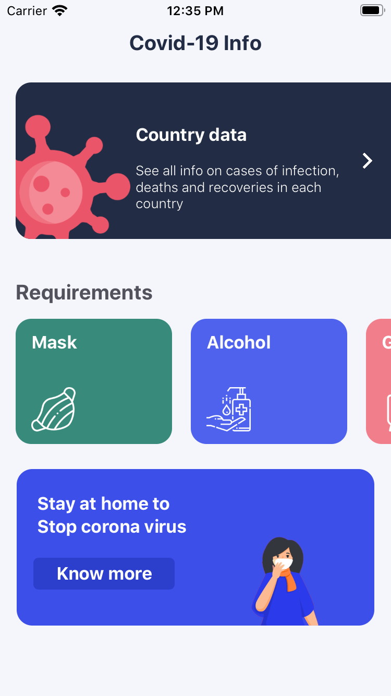
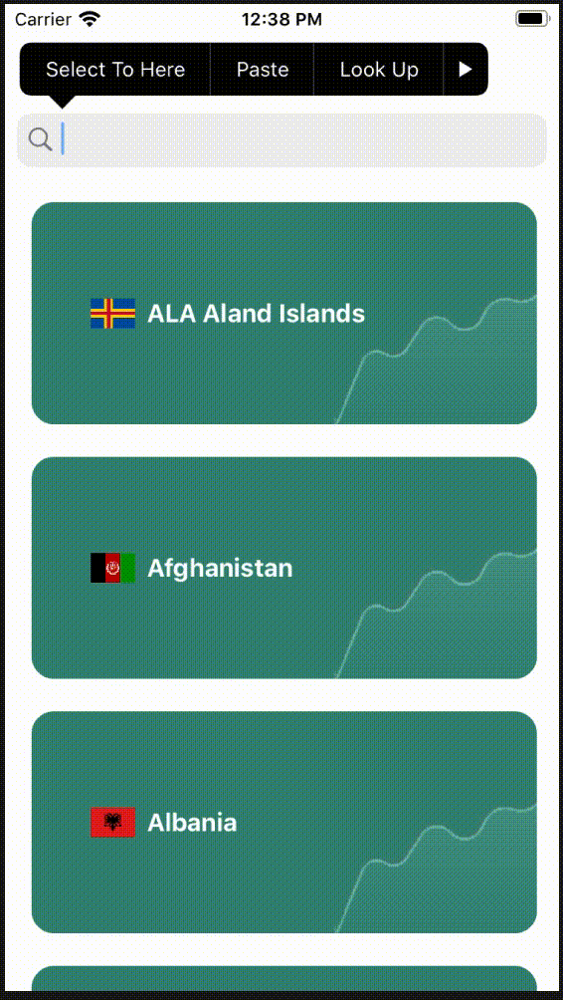
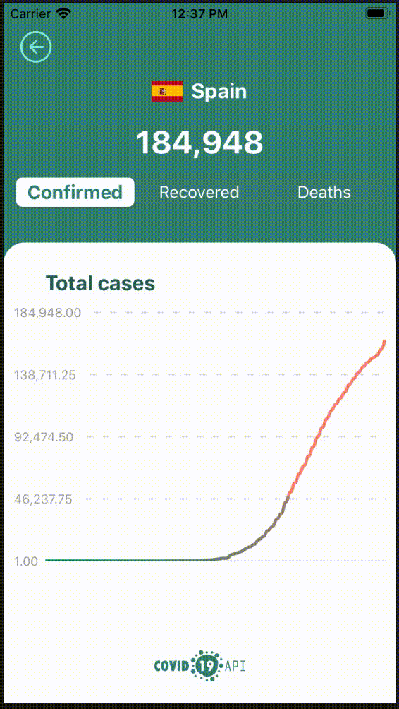

# Covid19SwiftUI

Covid19SwiftUI is an app to show the status of Covid-19.

This app is made for practicing SwiftUI and Combine.
Any ideas for improvement are welcome.

For the data I used the [Covid 19 API](https://covid19api.com/)

For the charts I used the [ChartView library](https://github.com/AppPear/ChartView)

### Screens

### Demo

Made with ❤️ from 🏠